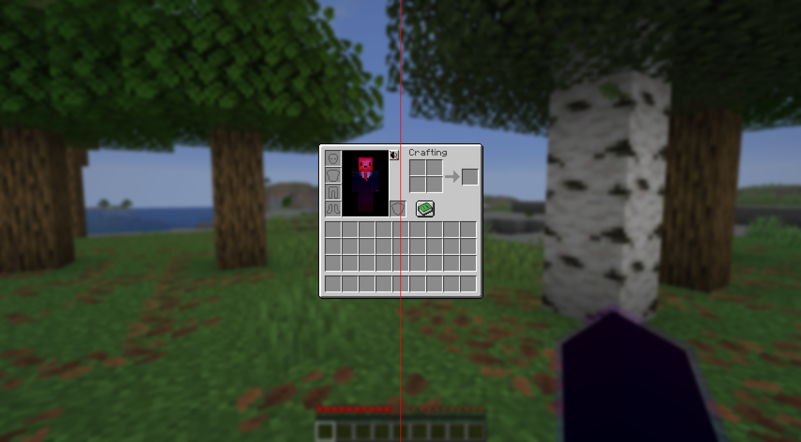
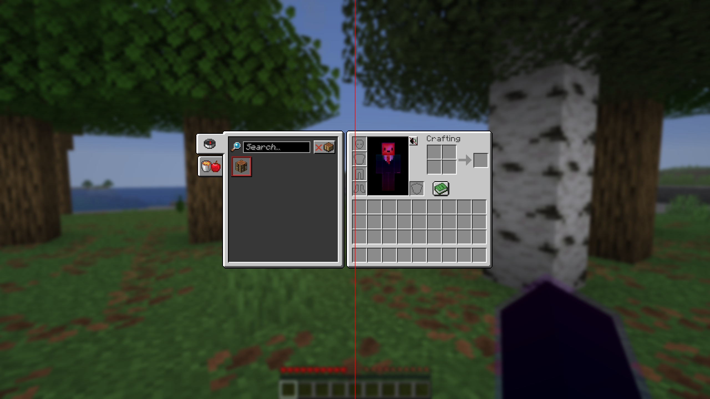
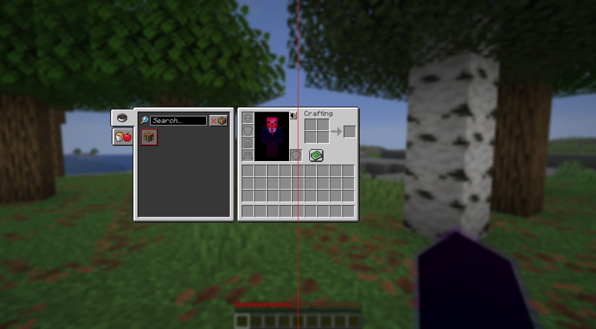

# Centered Inventory

A Fabric mod for Minecraft `1.21.11` that centers the player inventory screen when the recipe book is open

## What it does

| Before | After |
|--------|-------|
| Inventory is centered when recipe book is closed | Inventory stays centered when recipe book is opened |
|  |  |
| Vanilla pushes the inventory to the right | This mod keeps it centered |
|  |  |

- Centers the player inventory screen when the recipe book is visible.
- Preserves normal layout behavior when the recipe book is hidden or the window is too narrow.
- Applies the adjustment on the client side via a Fabric mixin.

## Build Instructions

```sh
./gradlew build
```

## Installation

1. Build the mod JAR using the command above.
2. Copy the generated JAR from `build/libs/` into your Fabric `mods/` folder.
3. Run Minecraft with Fabric Loader and Fabric API.

## License

This template is available under the CC0 license. Feel free to learn from it and incorporate it in your own projects.
